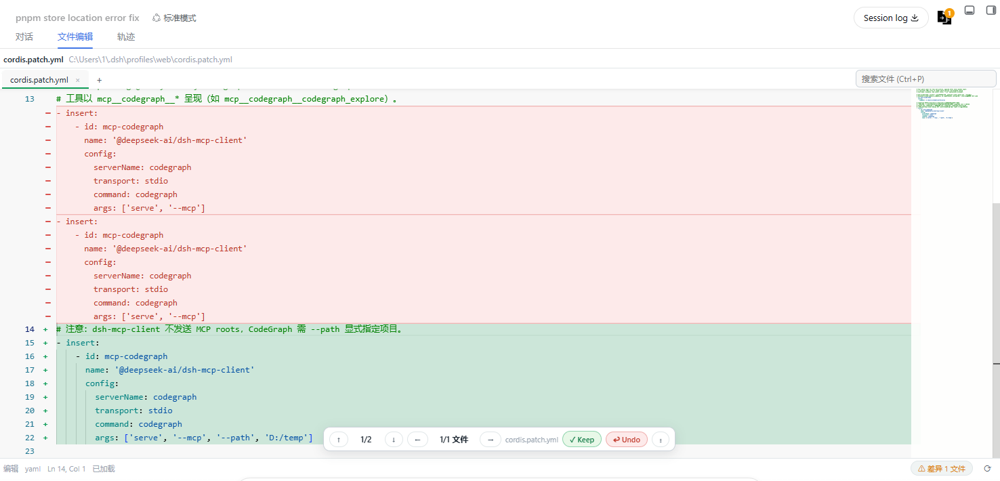

# dsh-vscode-mode

> 原 `@dsh-external/dsh-edit-review`（编辑差异审查）重构而来——DSH 上的**类 VSCode 编码体验**。

仿 VSCode 的 **Agent 文件编辑器 + 差异审查** DSH 插件：

- **中央「文件编辑」页签**（`conversation.view`，VSCode 式）：文件页签（脏点/关闭/「+」打开）+ `Ctrl+P`
  快速打开（QuickOpen）+ **Monaco Editor**（语法高亮/行号/minimap/`Ctrl+F`/`Ctrl+G`/`Ctrl+S`/700ms 防抖自动保存）+
  状态栏（路径/语言/Ln,Col/保存状态）。
- **差异审查**：Host 捕获 agent 的 `edit`/`write`（`tools/result`），客户端以**圆角悬浮框**（DiffBox）
  逐文件列出差异（采纳 Keep / 不采纳 Undo / 跳转 / 回滚 / 归档对比），header 差异角标 + 状态栏 chip
  （DiffLauncher 全局总览 + 归档/批次回滚）。状态持久化到工作区旁车（`.dsh-edit-review.json`，重启不丢）。
- **Monaco 离线分发**：`assets/vendor/monaco` AMD 构建随包发布，经 `/edrv/vendor/*` 前缀路由提供，全离线可用。

## 界面截图



> dsh-vscode-mode 的**编辑差异审查**界面：`cordis.patch.yml`（CodeGraph 配置）差异对比，
> 底部 Keep / Undo（保留 / 撤销）按钮控制采纳。
> Edit-review UI of dsh-vscode-mode: diff view of the `cordis.patch.yml` CodeGraph
> configuration with Keep / Undo controls.

## 安装（官方 `dsh plugin` 方式，三选一）

```bash
# ① Git 安装（clone + prepare 构建；推荐打固定 tag）
dsh plugin --profile web add github:Lenonss/DSH_VsCodeMode#v0.1.0

# ② npm 注册表（发布到 npm 后）
dsh plugin --profile web add dsh-vscode-mode

# ③ GitHub Release tgz 直装
dsh plugin --profile web add https://github.com/Lenonss/DSH_VsCodeMode/releases/download/v0.1.0/dsh-vscode-mode-0.1.0.tgz
```

> `dsh plugin ...` 是 pnpm 转发器：git 安装会克隆仓库、执行该包 `prepare` 脚本（tsdown 双面构建）后安装，
> 再按 `dsh.bundle` 声明自动加入 profile 的 bundles 层。若 pnpm 提示构建脚本需批准，按提示把 key
> 加到 `~/.dsh/profiles/<profile>/pnpm-workspace.yaml` 的 `allowBuilds` 后重跑。

**安装即生效，无需任何手动配置**：本包自带的 `cordis.patch.yml` 是标准 bundle 自挂载补丁
（`- insert: { id: dsh-vscode-mode, name: dsh-vscode-mode }`），加入 bundles 层后重启
DSH 即自动把插件行挂进 loader 树，**不要**再往 profile 用户层 `cordis.patch.yml` 手写
`insert`（旧的非标准做法，会与本 bundle 行撞同一 id，触发 duplicate loader entry id 启动失败）。

自定义配置（如图标目录 `imageDir`）用 **id 定向覆盖**合并到 bundle 行上，而不是再 insert 一次：

```yaml
# ~/.dsh/profiles/<profile>/cordis.patch.yml（用户层，应用顺序在 bundle 层之后）
- id: dsh-vscode-mode
  config:
    imageDir: C:/Users/me/Pictures   # 可选，默认读插件包内 assets/
```

> 迁移提示：若你之前按旧版指引在 profile 用户层手写过 `insert`（id 恰为 `dsh-vscode-mode`），
> 升级后请把那一段 `insert` 改成上面的 id 定向覆盖（或直接删除），避免与本 bundle 行重复装配。

更新：`dsh plugin --profile web update dsh-vscode-mode`；卸载：`dsh plugin --profile web remove dsh-vscode-mode`。

## 开发构建（自足，无需 DSH 源码 checkout）

```bash
pnpm install          # 安装 devDeps（typescript/tsdown/@types/node/@types/react/react/vitest）
pnpm build            # tsdown 双面：lib/index.js（host esm）+ lib/client.js（client cjs）
pnpm typecheck        # tsc --noEmit
pnpm test             # vitest 纯函数用例
npm pack              # 产物 tgz（含 lib/assets/src/cordis.patch.yml）
```

`scripts/build.sh` 已被 `dev_build_plugin` 等注入工具调用（本地标准构建）。
`prepare` 脚本 = 构建，git 安装 / npm publish 都会自动执行。

## CI（GitHub Actions）

- `.github/workflows/ci.yml`：push/PR → install → typecheck → test → build → `npm pack` 校验 + 上传 tgz。
- `.github/workflows/release.yml`：打 `v*` tag → 同上构建 → GitHub Release（附 tgz）→
  **若配置了 `NPM_TOKEN` secret** 则同时 `npm publish`（npm 通道）。
  未配 NPM_TOKEN 时仅 GitHub Release 通道，不影响安装。

## 源码结构

```
src/
├── index.ts            Host 入口：name/inject/apply（薄装配）
├── shared/             ★ 双面契约（禁 node/react）：types.ts（记录/归档/摘要）+ rpc.ts（11 个方法类型化）
├── model.ts            Host 纯域逻辑（可单测）：normalize/markDecision/resolved/summary/reconstruct/批次/归档
├── store.ts            Host 存储层：sidecar 读写合并 + 归档持久化 + stale 检测
├── workspace.ts        Host 工作区文件扫描（TTL 缓存）+ 快速打开搜索
├── revert.ts           Host 回滚/删除（fs + subprocess，fs.contains 边界校验）
├── registry.ts         Host 每工作区记录桶注册表
├── rpc.ts              Host RPC 分发表（类型化 handler 表替代巨型 switch）
├── routes.ts           Host webServer 路由（/edrv/rpc、/edrv/assets/*、/edrv/vendor/*）
└── client/
    ├── index.ts        Client 入口：slot 注册（inject=['slots','timer']）
    ├── rpc.ts          Client 类型化 fetch 包装 + 诊断日志
    ├── events.ts       窗口事件助手（edrv:refresh/open-editor/show-launcher）
    ├── state/          records.ts（摘要/计数/空差异）+ regions.ts（差异区域/行裁剪）纯函数
    ├── monaco/         loader.ts（AMD 加载/语言映射）+ diffRender.ts（差异自绘渲染器）
    ├── styles/editor.css  编辑区样式（tsdown CSS-inline 注入）
    └── ui/             EditorView（编排）/ QuickOpen / DiffBox / DiffBarEmpty / DiffLauncher / DiffBadge
```

**扩展缝（VSCode 化后续迭代）**：新能力 = `shared/rpc.ts` 加方法 + `src/rpc.ts` 加 handler +
`client/ui/` 加组件，其余模块零改动；`monaco/*` 是可复用的编辑器服务（资源树/对比/诊断面板共用）。

## 架构要点

- **捕获**：Host 监听 `tools/result`，对 `edit`/`write` 取 `result.value` + `result.meta.diffs` 落记录。
- **持久化**：工作区旁车 `.dsh-edit-review.json`（version 2，按 cwd 分桶，写前合并，v1 自动迁移）；
  归档 `.dsh-edit-review-archive.json`（按 path+batch 合并批次，含每 hunk 决策与 before）。
- **RPC**：静态包经 webServer 精确路由 `/edrv/rpc`，Client 同源 fetch；载荷形状由 `shared/rpc` 类型化。
- **批次/融合/归档**：每次新 edit/write 递增文件 batch，早于最新批次的未归档差异自动"融合"归档；
  每条差异处理完成（采纳/拒绝/被覆盖）立即单条归档；DiffLauncher「归档」页按批次浏览 + 回滚。
- **Client 挂点**：`conversation.view`（id `edrv-editor`）+ `conversation.session.header.utilities`
  （id `edrv-diff-badge`）。内部路由/slot/事件/CSS 前缀沿用 `edrv-*`（防回归），包身份为 `dsh-vscode-mode`。
- **⚠️ Host 改动需重启 DSH 应用**（Node ESM 模块缓存）；Client 经 `dsh-client-hmr` 热重载。

## 开发 / 卸载（超级模组注入器，开发期可选）

- 热装配：`dev_install_package {dir: packages/dsh-edit-review}`；更新：`dev_reload_package {packageName: "dsh-vscode-mode"}`
- 卸载：`dev_uninject_plugin {match: "dsh-vscode-mode"}`（生产环境用 `dsh plugin remove`）
