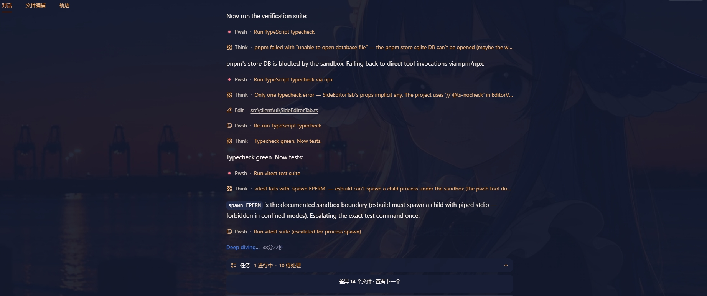
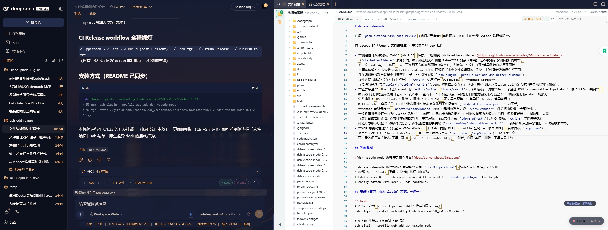

# dsh-vscode-mode

> DSH 上的**类 VSCode 编码体验**：Monaco 文件编辑器 + Agent 差异审查 + LSP 智能。
> 由 `@dsh-external/dsh-edit-review` 重构而来。

- 📝 **同屏编辑**：DSH 0.1.5+ 官方右侧 Sidebar，AI 对话与文件编辑同屏
- 🔍 **差异审查**：Keep / Undo / 回滚 / 归档，状态持久化重启不丢
- 🧠 **LSP 智能**：转到定义 / 查找引用 / Peek 多结果选择 / 智能补全（注释索引）/ 签名帮助
- ⌨️ **命令面板**：`Ctrl+Shift+P`，19 条命令开箱即用，可编程扩展

## 目录

- [特性](#特性)
- [安装](#安装)
- [使用指南](#使用指南)
- [配置](#配置)
- [截图](#截图)
- [开发](#开发)
- [常见问题](#常见问题)
- [更新日志](#更新日志)

## 特性

### 1. 侧边栏文件编辑（推荐形态）

检测到 DSH 0.1.5+ 官方右侧 Sidebar（`ctx.sidebarRightTabs` / `ctx.sidebarRight`）时，
编辑器注册为官方侧边栏 Tab，AI 对话（中央）与文件编辑（右侧）同屏，支持官方
多标签 / 分栏 / 浮出 / 全屏，打开路由即开即展开，官方引导页提供入口。

- **形态优先级**：官方 Sidebar > [dsh-better-sidebar](https://github.com/omdsh-dev/DSH-better-sidebar)
  （桥已归档，仅作旧版回退）> 中央文件编辑页签（零新依赖完整可用）；
  编辑器顶部与设置页「兼容性」子 Tab 给出对应引导。
- **文件链接（DSH 0.1.5+）**：聊天 / 文件树链接经官方 `ctx.sidebarRight.openResource`
  直达右侧栏；「文件链接使用工具」为 自动 / VSCodeMode 时以 extension 档认领
  `dsh-resource://file/**`（Monaco 打开，含行号定位），为「官方侧边栏」档时走
  官方文本查看器；畸形地址自动回落官方查看器。
- **文件页签**：脏点 / 关闭 / 「+」打开 / 右键菜单 / 固定（📌 排最前、隐藏 ×、
  随工作区持久化；**固定 = 保护**，批量关闭永不误关固定页签）。
- **页签数量上限**（通用设置 `maxOpenEditors`，默认 10，**0 = 不限制**）：超限时自动
  关闭**最久未使用**的页签；固定页签与当前活动页签受保护，脏页签在关闭前静默落盘。
- **页签栏滚轮横滚**：页签栏溢出（出现水平滚动条）时，鼠标滚轮（含触控板纵向手势）
  直接横向滚动页签栏；不溢出时不接管，`Shift+滚轮` 沿用浏览器原生横滚。
- **页签右键菜单**（对齐 VS Code）：添加到对话 / 关闭·关闭其他·关闭右侧·关闭已
  保存·全部关闭（`Ctrl+F4` 关当前）/ 复制路径·复制相对路径 / 在文件资源管理器
  （视图）中显示。关闭前未保存页签静默落盘；浏览器无法实现的条目（向右拆分 /
  新窗口）不提供。
- **工作区搜索填充**：编辑器有选中时按 `Ctrl+Shift+F`，选中文本自动填入搜索框并
  立即搜索（多行选区取首行；填入后全选，便于直接改写）。
- **Markdown 预览**（v0.5.3）：打开 `.md` / `.markdown` 后，工具栏「预览」按钮、
  `Ctrl+Shift+V` 或命令栏「切换 Markdown 预览」切入 GFM 渲染（标题/列表/表格/代码块/
  引用/KaTeX），「以源码打开」切回编辑。渲染走官方 `MarkdownText` 原语，零新增依赖、
  自动跟随 DSH 主题；旧版 DSH 缺该原语时降级为纯文本预览。活动文件不是 Markdown 时
  不吞 `Ctrl+Shift+V`（保留「粘贴为纯文本」）。
- **Monaco Editor**：语法高亮 / 行号 / `Ctrl+F` / `Ctrl+G` / `Ctrl+S` /
  700ms 防抖自动保存；顶部工具栏显示 路径 / 语言 / Ln,Col / 保存状态，提供
  差异 / 侧边栏 / 刷新入口。
- **导航历史**：后退 / 前进跨文件恢复焦点位置（工具栏 `←`/`→`、`Alt+←/→`、
  `Ctrl+Alt+-` / `Ctrl+Shift+-`、鼠标侧键 XButton 均可触发）；后退后新导航
  自动清空前进栈。

### 2. 命令栏与指令系统（v0.2.0）

`Ctrl+Shift+P`（或 `F1`）唤出 VS Code 式命令面板：输入即过滤（中文 / 分类 /
命令 id 均可命中），`↑↓` 选择、`Enter` 执行、`Esc` 关闭，每行显示 命令名 /
分类 / 当前键位；需要打开文件的命令在空编辑器时自动隐藏。

- **单一数据源**：命令目录（`ui/commandCatalog`）同时驱动命令栏、快捷键设置页、
  全局键位派发、Monaco 右键菜单——新增能力只需追加一条命令定义。
- **开放注册表**：`window.__edrvCommands__` 暴露 `register()` 注册命令、
  `addRuntimeKeybinding()` 绑运行时键位（不落设置 schema）。
- **开箱 20 条命令**：保存 / 快速打开 / 在文件浏览器中打开 / 显示所有命令 /
  切换侧边栏 / 工作区搜索 / 切换 Markdown 预览 / 后退·前进 / 上下页签 / 关闭当前页签 /
  上下编辑行 / 转到定义 / 查找引用 / 触发 AI 补全 / 配置代码片段 / 插入代码片段 /
  选中内容加为引用。

### 3. 代码片段（v0.3.0，VS Code 兼容）

支持 `.code-snippets`：`Ctrl+Shift+P` →「代码片段：配置代码片段」打开**居中浮窗**
（现有片段文件列表 + 新建入口），在 Monaco 中按普通文件编辑（JSON 高亮 /
保存即生效 / 支持 `scope` 字段）。

- **两处片段库**：全局 `~/.dsh/snippets/`（所有项目）+ 项目
  `<工作区>/.dsh/snippets/`（随仓库共享）；文件名即生效语言
  （`lua.code-snippets` → 仅 lua，`global.code-snippets` → 全语言），
  新建时可选生效语言。
- **IntelliSense 补全**：编辑 `.lua` 等文件时 `prefix` 自动列出（片段图标 +
  `body` 预览，`Tab` / `Enter` 展开，`$1` / `${2:默认值}` 占位符与 `$TM_*`
  变量可用）；也可「插入代码片段」按语言筛选插入光标处。
- RPC：`snippets.list/read/save/remove/entries`；保存后自动刷新补全缓存。

### 4. 快捷引用（v0.3.0）

选中内容后 `Ctrl+U` 把选中行范围加为**引用**（送入对话上下文，等价 VS Code 的
「Add Selection to Chat」）；无编辑器 / 无选中时该键位不吞键，正常输入不受影响。
（v0.3.1 修复可用性判定：改用与输入实现无关的 `.edrv-editor-row .monaco-editor`
判据，替换被 Monaco EditContext 输入通道取代的 `textarea.inputarea` 探测。）

- **插入点跟随输入框光标**（`caretSpan()`；无光标信息回落文档末尾，选中区域插在
  选区右边界而不替换），修复「连续添加多个引用时既有 chip 被销毁并重复为纯文本」。
- 通道被拒时降级为就地纯文本（保留既有 chip 与正确分隔空格）；两条通道都不可用
  则不写任何内容并提示重试。

### 5. LSP 智能（编辑器内）

`F12` / 右键「转到定义」、`Shift+F12`「查找所有引用」、`Ctrl+点击` 引用导航、
`Ctrl+hover` 可导航标识符下划线提示。v0.4.2 起统一委托完整 Monaco 原生命令：
**多结果弹 Peek 让用户选**，单结果直跳，取不到定义自动降级「转到引用」。

- **智能补全**：输入 `.` / `:` / `(` / `[` 自动弹出候选（`Ctrl+Space` 手动触发）。
  EmmyLua 的注释索引（`---@class` / `---@field` / `---@type`）会被解析为真实的成员列表，
  即对 `---@class` 标注的实例打 `p.` 能列出注解声明的字段/方法；候选项带类型图标、
  弃用标记与片段展开（`${1:占位}`）。文档走 `completionItem/resolve` 惰性拉取，列表响应保持轻量。
- **签名帮助**：函数实参处（输入 `(` / `,`）显示参数签名并按当前实参高亮；
  多签名可切换。
- 定义查找带降级链（definition → declaration → 引用推导）；参数 / 局部变量
  （`this`、`pTarget` 这类）同样能跳到声明。
- 相关踩坑与修复见 [常见问题](#常见问题) 第 1–4 条。

### 6. 差异审查（核心能力）

Host 捕获 agent 的 `edit` / `write`（`tools/result`），客户端统一使用**唯一一个**
挂在 DSH `conversation.input.dock` 的 DiffBox 实例：

- 编辑器未打开 → 紧凑「差异 N 个文件 · 查看下一个」按钮，点击自动打开侧栏编辑器
  并聚焦差异；编辑器打开后 → 完整操作条（Keep / Undo / 跳转 / 回滚 / 归档对比），
  不会再出现第二个差异栏。
- header 差异角标 + DiffLauncher 全局总览 + 归档 / 批次回滚；状态持久化到工作区
  旁车 `.dsh-edit-review.json`（重启不丢）。
- v0.4.3 起单文件 Keep / Undo 覆盖**冲突差异**（pending hunk 已被后续修改覆盖）：
  Keep 记账后归档；Undo 对已不在文件中的差异不改动文件、直接按不采纳归档
  （状态栏提示「其中 N 处已不存在于文件，未改动」）。

### 7. Monaco 离线分发

`assets/vendor/monaco` AMD 构建随包发布，经 `/edrv/vendor/*` 前缀路由全离线可用。
版本锁定 `monaco-editor@0.42.0-dev-20230906`（commit `e7d7a5b0`），用
`node scripts/vendor-monaco.mjs [--force]` 从 npm registry 复现铺入
（版本 + commit 双重断言，防静默换错构建）。

- v0.4.0 起为**官方完整构建**（`referencesController` / `peekView` / `gotoSymbol`
  齐备），修复「查找引用完全没反应」；本地化只保留英文基线 + 简体中文
  （`KEEP_NLS`），`sourceMappingURL` 铺入时剥离（官方指向未分发的 `min-maps/`）；
  构建后 vendor 约 10.3MB（替换前 21.5MB）。

### 8. PDF 浏览与编辑（v0.1.55）

打开 `.pdf` 在编辑区页签内直接浏览（连续滚动 / 翻页 / 缩放 / 文本选择，
cmaps 支持中文渲染）；工具条进入注释编辑：✎ 文本框 / 🖌 画笔 / 🖍 高亮，
`Ctrl+S` 或 💾 保存把批注写回原文件（`pdfDocument.saveDocument()` →
`edrv.saveBinary` base64 回写，工作区边界 + 32MB 上限约束）。

- 引擎离线 vendor 于 `assets/vendor/pdfjs`（build + viewer + cmaps +
  standard_fonts，约 5MB），经 `/edrv/vendor/pdfjs/*` 分发；升级用
  `node scripts/vendor-pdfjs.mjs [版本]`。
- 借鉴开源 [pdf.js](https://github.com/mozilla/pdf.js)（Apache-2.0）。
- **能力边界**：注释级编辑（开源方案不支持无损改写既有正文文字）；加密 PDF
  暂不支持。

### 9. 文件管理侧边栏（类 VSCode 活动栏 + 面板）

编辑器内嵌活动栏 + 可拖拽调宽面板区；首期「资源管理器」= 懒加载目录树
（展开实时读取、点文件打开、差异角标、活动文件高亮、`edrv:refresh` / 手动 ⟳、
`Ctrl+B` 显隐并持久化），侧栏形态默认收起以节省面板宽度。

- 拖拽调宽下限 = 最小宽度（默认 300，设置 → VSCodeMode → 通用「编辑器」
  可调 180–560），拖拽低于最小宽度自动收起。
- 面板经注册表装配（`ctx.provide('edrvSidebarPanels')`），新增面板只加一条注册，
  不改编辑器布局。
- **资源管理器右键菜单**（v0.7.0，对齐 CodeBuddy 参考图，区分文件 / 文件夹 / 根空白区）：
  - 文件：打开方式…（已注册打开器中选择）｜ 在文件资源管理器中显示 ｜ 添加引用
    到对话 ｜ 剪切·复制 ｜ 复制路径·复制相对路径 ｜ 重命名…·删除 ｜ SVN 组。
  - 文件夹：新建文件…·新建文件夹（名称支持 `a/b.c` 嵌套）｜ 在文件资源管理器
    中显示 ｜ 添加引用到对话·在文件夹中查找…（搜索面板带目录过滤）｜ 剪切·复制·
    粘贴（剪贴板空时灰显）｜ 复制路径·复制相对路径 ｜ 重命名…·永久删除 ｜ SVN 组。
  - 根空白区 = 文件夹菜单去掉全部「仅非根」项；参考图中本架构无法实现的条目
    （在集成终端中打开 / 运行测试 / Build 等）不显示。
  - 文件管理写操作走 `edrv.fsCreateFile / fsCreateDir / fsRename / fsDelete /
    fsCopy / fsMove`（工作区边界 + 同名拒绝 + 名称校验），删除带确认；重命名 /
    移动 / 删除与开着的页签自动同步（路径改写 / 关签）。剪切·复制·粘贴为应用内
    文件剪贴板（浏览器无系统文件剪贴板，语义对齐 VS Code）。

### 10. 规则管理（v0.1.49 / v0.1.50，参考 Codebuddy）

活动栏「规则」面板，管理 Cursor / Codebuddy 式 `.mdc` 规则文件：「用户规则」
（`~/.dsh/rules/`，全局生效）与「项目规则」（`<工作区>/.dsh/rules/`，随仓库
共享）双 Tab。

- 每条规则显示 文件名 / 相对路径 / 类型徽标（总是 = `alwaysApply`、自动 =
  `globs`、手动 = 仅索引）/ 描述；右侧常驻 编辑 / 删除 与滑动启用开关
  （只改写 frontmatter `enabled` 行，即时生效无需重启）。
- 新建 / 编辑提供面包屑头部 + 类型下拉与描述 / globs 控件，与原始 `.mdc`
  文本域双向同步（控件改写 frontmatter，文本域回读控件；`enabled` 与其余键
  原样保留）。
- 启用的规则经 host `systemPrompt.section`（order 400）注入每次装配：用户规则
  全局注入，项目规则按会话工作区注入（单条 16KB / 单域 64KB 截断预算；旧版
  DSH 无该服务时自动降级为纯管理 UI）。RPC：`rules.list/read/save/remove/toggle`。

### 11. MCP 可视化管理（设置 → VSCodeMode）

子 Tab「我的 MCP」（profile 全局）+「项目 MCP」（各项目根 `.mcp.json`，
对齐 Claude Code / Cursor，随仓库共享）：查看各项目连接状态 / 工具、添加
（stdio / streamable-http）、刷新、启用 / 禁用、删除。工具全局生效。

### 12. 插件自带技能组（v0.3.3）

一组 `SKILL.md` 随包分发并注册进 DSH 技能系统（自定义 skill provider，
`ctx.skills.registerProvider`）——**装了本插件即可用**，无需手工放到
`~/.dsh/skills`。当前收录 **`dsh-vscodemode-mcp`**（MCP 配置与使用指南：
两种作用域 / `.mcp.json` 写法 / `mcp.*` RPC / 命名与冲突 / 工作区隔离 /
故障排查表）。装载状态见 设置 → VSCodeMode →「兼容性」→「插件技能组」；
编辑 SKILL.md 即时生效（fs.watch → invalidate）。

- **命名硬约束**：技能名必须 kebab-case（`/^[a-z0-9]+(?:-[a-z0-9]+)*$/`），
  下划线非法（`@deepseek-ai/dsh-skill` 直接拒绝）；本插件另加前缀白名单
  （不以 `dsh-vscodemode-` 开头跳过并告警，避免污染全局技能命名空间）。
- **frontmatter**：`name`（必填，kebab-case + 前缀）/ `description`（必填，
  模型靠它判断何时加载）/ `whenToUse`（可选）/ `disable-model-invocation`
  （true = 不进模型目录，仅人工显式调用）/ `user-invocable`（false = 禁止
  人工显式调用）；不接受遗留写法 `disableModelInvocation` / `modelInvocable` /
  `userInvocable`。
- **装载与降级**：`ctx.inject(['skills'])` 惰性获取（不写进 `inject` 数组），
  skills 服务缺失时插件其余功能不受影响；服务缺失 / 无 `registerProvider` /
  名冲突 → warn 跳过，不抛错、不影响装配；监听不可用时降级「改动需重载插件」。
- **为什么自研 provider**：开发形态（junction 安装）下官方
  `@deepseek-ai/dsh-skill-filesystem` 按 realpath 解析 import 会
  `ERR_MODULE_NOT_FOUND`（walk 不到 profile 的 node_modules），且每实例会
  多拉 chokidar watcher；自研零新依赖、开发 / 正式形态行为一致、可单测。

### 13. 会话性能管理（设置 → VSCodeMode →「性能优化」）

DSH 启动回放 `~/.dsh/sessions` 全部会话（V8 展开约 10×，可能 OOM）。该子页
提供四项治理手段：

- **盘点**：全工作区会话体积 / 活跃度 / 新旧一览（`edrv.perf.inventory`）。
- **移出归档（可逆）**：巨型 / 旧会话移到 `~/.dsh/sessions-archive`
  （同卷 rename + `.manifest.json`），免重启即从下次启动回放剔除；支持恢复 /
  清除（`movePlan / moveOut / restore / purgeArchive`）。活跃会话一律拒绝移出。
- **压缩调优**：一键把更低 `compaction-basic`（0.6 / 0.12）与 `tool-result-pruner`
  （4096）阈值写入 profile `cordis.patch.yml`（标记块 + 备份 `.bak-<ts>`，可撤销，
  重启生效）；⚠️ 压缩只追加事件、**不重写**已持久化日志——**存量瘦身靠
  「移出到归档」**。
- **会话体积指示器**：对话 header `edrv-perf-size` ≥1MB 显示、≥2MB 琥珀、
  ≥8MB 红，引导「一次任务一个短会话」。
- 治理原则：存量靠归档、增量靠压缩调优 + 短会话习惯 + 体积指示器；packChunks
  （chunk 打包存储）为 DSH 默认开启，无需再配置。

### 14. 外部改动自动同步（即将发布）

磁盘文件被外部改动（其他编辑器 / Unity / 脚本 / agent 工具 / 同步盘）后自动
跟进，不必手点 ⟳：

- **观测**：客户端每 1.5s 把已打开页签路径批量交给 host `edrv.versions`
  （一次请求多条 `fs.stat`，标签页隐藏时整轮跳过），与本地版本基线比对；
  文件树对应目录同步失效，客户端按 `edrv:file-changed` 事件去抖强制重列。
- **判定**：版本变化后**必须再比一次内容**（版本令牌含 `ctime`，格式化工具 /
  同步盘的「同字节重写」也会让它变化）；内容一致 → 只推进基线（不重载）；
  内容不同且缓冲**干净** → 自动刷入并提示「已同步外部修改」；内容不同且有
  未保存编辑 → **绝不覆盖**，编辑区提示条三选一（重新加载 / 覆盖磁盘 /
  保留本地）+ 状态栏「⚠ 外部已修改」；文件被删 → 提示「已被外部删除」，
  缓冲保留。
- **保存护栏**：保存带回上次读取的版本令牌，host 用 `replaceIfVersion` 守卫
  写入——磁盘被外部改过时**拒绝保存**并提示「文件已被外部修改」，由用户显式
  选择重新加载或用编辑器内容覆盖；冲突未处理期间自动保存被抑制。
- 老 host（无该 RPC）自动降级为无同步、无护栏，不报错。

### 15. 系统集成（v0.1.53）

设置 → VSCodeMode → 通用 →「系统集成」卡片，两项能力：

**① 文件管理器右键菜单**——一键把「在 DSH 文件编辑中打开」注册进系统：
Windows 资源管理器三类入口 / Linux Nautilus + Dolphin / macOS Automator 配方；
插件卸载自动清理、更新自动恢复；点击经 launcher 打开默认浏览器深链，编辑器
直接打开所选文件；DSH 未运行时弹提示。

**② Unity 外部脚本编辑器**——内置 UPM 包 `com.dsh.editor`（参照
com.unity.ide.traeCN 机制实现 `IExternalEditor` 虚拟安装，无需本地 exe），
设置页一键安装 / 更新为 Unity 内嵌包（复制到 `<项目>/Packages/com.dsh.editor`，
自动发现、不改 manifest.json）；Unity Preferences → External Tools 选
「DSH 文件编辑」后，双击脚本 / Console 报错跳转即在浏览器打开对应文件与行列。

**深链契约**（launcher / Unity 包 / client 三端共用）：

```
http://127.0.0.1:3080/?edrvOpen=1&edrvPaths=<enc1>[,<enc2>…][&edrvLine=N][&edrvColumn=M]
```

每段路径独立 `encodeURIComponent`、逗号连接；client 解析后按下方「打开规则」
路由，处理完剥离参数防刷新重开，跨源 referrer 守卫防外部网页诱导。

**打开规则（智能路由）**——按首路径类型分派（其余路径：文件进编辑器、
文件夹补引用）：

| 首路径 | 行为 |
|---|---|
| 文件夹，在已注册工作区内 | 弹窗二选一：**使用最近的工作区**（跳转 + 新增对话 + 文件夹引用 + 编辑页）/ **新建工作区**；取消则中止 |
| 文件夹，不在任何工作区 | 不弹窗，以该文件夹为根注册新工作区 + 新增对话 + 引用 + 编辑页 |
| 文件，在已注册工作区内 | 有会话 → 打开最近对话 + 编辑器展开（行列透传）；无会话 → 新建对话 + 文件引用 + 展开 |
| 文件，不在任何工作区 | 打开最近一次对话 + 编辑器展开 |
| 文件，无任何工作区 / 对话 | 以文件父目录注册工作区 + 新建对话 + 引用 + 编辑器打开 |

**页面复用**：launcher 先向 host 投递待打开请求（`edrv.external.handoff`）——
已打开的 DSH 页面（3s 移交轮询）就地执行打开规则，**不重复开新页**；2s 未领取
（页面刚关 / 后台节流）或无活跃页面时回退打开新页（URL 深链）。时序：等待会话 /
工作区列表就绪（≤15s）；`sessions.create / workspaces.create` 为 DSH 官方服务
方法；引用插入轮询输入门面就绪（忙态自动降级纯文本）。

**各平台注册细节**：

- **Windows**：`assets/shell/dsh-open.cs` 复制到 `~/.dsh/dsh-vscode-mode/shell/`
  并用 .NET Framework 4.x `csc.exe` 编译为 `dsh-open.exe`（WinExe 无闪窗；
  csc 缺失自动降级 `dsh-open.ps1`）；写三类 HKCU 键
  `HKCU\Software\Classes\{\*,Directory,Directory\Background}\shell\DSHEditor`
  （显示名 + Icon `dsh-whale.ico` + command，首次注册前 `reg export` 备份）。
  全部 reg/csc 调用走 host `subprocess.spawn` argv 数组（stdio `inherit`，
  受管环境禁管道），无 shell 插值。
- **Linux**（纯文件写入，无需管理员）：Nautilus 右键脚本（`NAUTILUS_SCRIPT_SELECTED_FILE_PATHS`
  多选）+ KDE Dolphin 服务菜单（`%F` 多选，兼容旧 `kservices5/ServiceMenus/`）。
- **macOS**：Finder 菜单不做自动生成——设置页「复制 Automator 配方」按步骤创建
  快速操作（约 1 分钟，脚本指向 `shell/dsh-open.sh`），创建后面板自动检测显示 ✓；
  「移除注册」仅删除引用本插件 launcher 的 workflow。
- **行为**：launcher 读同目录 `dsh-open.ini`（`base=` 深链基址，注册时按设置写入）
  → 探测端口（Windows TcpClient / POSIX curl，1s）→ 未运行弹提示（MessageBox /
  osascript / notify-send / zenity）→ 路径编码合并为一个 URL 交给默认浏览器
  （POSIX 侧 `LC_ALL=C` 逐字节 percent-encode，中文 / 空格 / 任意字符安全）；
  改「DSH 服务地址」后点「注册」刷新 ini。
- **生命周期**：注册成功写 marker（`shell/registered.json`）→ 插件卸载 / reload
  自动清理注册痕迹，重启 / 更新后自动恢复（开发态反复 reload 不丢注册）；点
  「移除注册」删除 marker，此后不再自动恢复；强杀进程跳过清理时残留键由下一次
  启动的幂等重写与「移除注册」兜底。
- RPC：`edrv.integration.status / register / unregister`。

**Unity 包细节**：包源随插件分发于 `unity/com.dsh.editor/`（`package.json` +
`Editor/DshCodeEditor.cs` + asmdef，`"unity": "2019.4"` 基线；虚拟安装
`dsh-editor://vscode-mode`，`OpenProject` → `Application.OpenURL(深链)`，不生成
csproj）；**打开过滤**：仅文本 / 代码类扩展名（白名单 + `EditorSettings.projectGenerationUserExtensions`
用户自定义扩展）交 DSH 打开，其余返回 `false` 交还 Unity 原生（双击预制体进
预制体模式、双击场景开场景），对齐官方 `DefaultExternalCodeEditor` 行为；
安装 / 更新 = 整目录复制 / 替换为 `<项目>/Packages/com.dsh.editor`（目标已存在
且 name 不是 `com.dsh.editor` 时拒绝覆盖），Unity 已打开时切回窗口自动刷新；
卸载 = 删除该目录；手动兜底：Package Manager → Add package from disk 选
`unity/com.dsh.editor`；登记清单存 `~/.dsh/dsh-vscode-mode/unity-projects.json`；
RPC：`edrv.unity.list / add / remove / install`。
安全说明：深链可在编辑器中查看任意绝对路径文件（与用户手动打开等价）；保存仍
受会话沙箱 `policyOf` 约束，工作区外保存被拒是预期行为。

### 16. SVN 集成（v0.5.0）

底座是 **svn CLI**（跨平台，自动探测 `svn --version` / 工作副本根），
TortoiseSVN（`TortoiseProc.exe`）仅作 Windows 过渡增强：自研能力覆盖后对应官方项自动隐藏。

- **状态与变更**：侧栏「SVN」面板列出工作副本变更（`svn status --xml --no-ignore`），
  按状态着色与字母徽标、changelist 分组、未版本控制 / 忽略项开关、行内右键动作；
  文件树行尾同步显示状态徽标。
- **动作**：更新、刷新变更、与基线比较、加入版本控制、还原（**破坏性动作均带确认**）、
  清理工作副本（默认只清锁）；未覆盖的项回落 TortoiseSVN。
- **日志弹窗**（对标 TortoiseSVN Revision Log Dialog）：过滤语法（空格=AND / `-` 排除 /
  `+` 纳入 / `!` 取反 / `"短语"` / 正则）、From-To 日期区间、列头排序 + 复位、
  上中下三段布局（列表 / 提交信息 / 变更路径，边界可拖拽）、Actions 徽标、
  受影响路径灰显或隐藏、Copy from 列、右键菜单、`F5` / `↑↓` 键盘、
  多选（Ctrl / Shift）与「比较两个修订」、**Stop on copy**、**Show Range 区间**、
  **Include merged revisions**（`-g`，合并进来的修订灰字缩进）、
  Show All（上限 5000 条，超出用区间取）、Statistics 统计窗（期间 / 按作者 / 按日期）、
  工作副本版号行加粗。
- **并排差异**：`与上一版本比较`（`cat -r REV` vs `REV-1`）、`比较两个修订`（`-r M:N` 方向按选中顺序）、
  `与工作副本比较`、`某版本 ↔ 工作区`，均复用同一差异视图。
- **诊断日志**：统一日志器 + `edrv.dlog.*` RPC + 命令栏「查看诊断日志」，
  排查白屏 / 加载失败时先看它。
- **RPC**：`svn.status / changes / diffBase / revert / add / log / diffRev / diffPair /
  diffWorking / wcRev / cleanup / update / tortoise`。

> 说明：`plans/`（含对标蓝图与实测结论）为本地开发资料，不入库。

### 17. 断点调试（DAP，开发中）

编辑器内断点调试（DAP 桥通用化：适配器由扩展清单 `contributes.debuggers` 驱动，
不限定语言；Lua 链路复用已装 emmylua 扩展适配器，**零游戏侧改动**）：

- **断点**：编辑器行首点击（或 `F9`）切换断点，红点/灰点（禁用）持久化跨刷新保留；
  鼠标悬停在行首/行号区时显示**半透明预览红点**并切换为手型光标（对齐 VS Code 的 breakpoint hint）；
  侧栏「调试」面板断点列表支持启停复选框 / 删除 / 点击跳转（VS Code 断点视图形态）。
- **断点右键菜单与编辑浮层**（逐条对齐 CodeBuddy / VS Code 内核，文案取自官方中文语言包）：
  空行 → `添加断点` / `添加条件断点...` / `添加记录点...` / `添加触发的断点...`；
  已有断点 → `删除 断点`（`Delete`）/ `编辑 断点…` / `禁用断点`（记录点场景名词自动切换为「记录点」）；
  暂停中额外追加 `运行到行`。「编辑断点…」打开**整宽行内浮层**（View Zone：横跨整个编辑区、
  把下方内容推开，并高亮目标行）：左侧「模式下拉」（`表达式` / `命中次数` / `日志消息` / `等待断点`）+
  右侧**单行输入框**，切换模式时各模式内容独立记忆；`Enter` 确认、`Escape` 取消
  （提示写在输入框占位里）。
- **启动**：编辑区右上浮动工具条选择配置（读取工作区 `.dsh/launch.json`——插件专属文件，
  与 VS Code 的 `.vscode/launch.json` 互不干扰，旧共用文件首次读取时自动迁移过来；类型可用性由
  扩展清单裁决：未发现适配器/入口缺失的类型在下拉置灰并给原因）→ `F5` 启动/继续。
  `emmylua_attach` 按进程名自动附加（复刻 VS Code 扩展的进程枚举语义：窗口标题/进程名包含匹配，
  多候选时工具条切进程选择器明确选择）。
- **命中暂停**：断点命中自动打开对应文件并高亮停帧行；适配器上报 chunkname 由插件工作区
  索引反向映射为工作区文件（`findFileReq` 反向请求应答）。
- **四段调试面板**（活动栏「调试」）：调用堆栈（点击跳转）/ 变量（懒展开树，Variables + ENV）/
  监视（表达式持久化，暂停态求值）/ 断点 + 底部**调试控制台**（REPL 输入表达式即时求值）。
- **实现**：host 半 DAP 桥（`src/dap/*`）spawn 扩展清单声明的 DAP 适配器（`runtime: node`
  跑 js 入口 / 无 runtime 直启原生 exe，清单 `args` 随行），事件经缓冲 + 400ms
  活跃轮询上抛；断点先落 host，适配器就绪（initialized）后全量下发，并按适配器能力位
  发送 `configurationDone` 收尾握手（emmylua 未声明该能力 → 不发，行为不变）。
  `.dsh/launch.json` 配置全量透传给适配器（未识别字段原样保留，`${workspaceFolder}`/`${cwd}`
  已替换；`${command:...}` 为 VS Code 命令占位，启动时明确报错而非假解析）。
  命中行解析用 Monaco 官方 `getTargetAtClientPoint`（手算需扣 `padding-top`，实测易错行）。
- **回执与多线程**：断点回执消费适配器真实响应（可能挪行/判不可验证），未验证断点渲染
  空心红圈（对齐 VS Code）；栈帧 id 用适配器原生值（emmylua 保持栈下标私有语义），
  stopped 事件携带的真实 threadId 贯穿调用栈/单步/暂停（多线程适配器必需，emmylua 恒 1 不变）；
  断点按适配器声明语言过滤下发，杜绝跨语言串发。
- **能力边界**：`emmylua_attach` 仅 Windows（适配器原生限制）；适配器自动探测
  `~/.vscode/extensions`、`~/.vscode-server/extensions` 与插件扩展目录
  `~/.dsh/dsh-vscode-mode/extensions`（与 LSP 探测根一致）；求值/查看变量需处于暂停态。
  `运行到行` = 临时断点 + 继续（命中/手动继续后自动清理，不污染用户断点表）；
  `添加触发的断点...` 当前适配器不支持 → 点击给出明确提示（不做静默失败的假功能）。

## 安装

官方 `dsh plugin` 方式，三选一：

```bash
# ① Git 安装（clone + prepare 构建；推荐打固定 tag）
dsh plugin --profile web add github:Lenonss/DSH_VsCodeMode#v0.8.0

# ② npm 注册表（发布到 npm 后）
dsh plugin --profile web add dsh-vscode-mode

# ③ GitHub Release tgz 直装
dsh plugin --profile web add https://github.com/Lenonss/DSH_VsCodeMode/releases/download/v0.8.0/dsh-vscode-mode-0.8.0.tgz
```

> `dsh plugin ...` 是 pnpm 转发器：git 安装会克隆仓库、执行该包 `prepare` 脚本
> （tsdown 双面构建）后安装，再按 `dsh.bundle` 声明自动加入 profile 的 bundles
> 层。若 pnpm 提示构建脚本需批准，把 key 加到
> `~/.dsh/profiles/<profile>/pnpm-workspace.yaml` 的 `allowBuilds` 后重跑。

**安装即生效，无需任何手动配置**：本包自带的 `cordis.patch.yml` 是标准 bundle
自挂载补丁（`- insert: { id: dsh-vscode-mode, name: dsh-vscode-mode }`），加入
bundles 层后重启 DSH 即自动把插件行挂进 loader 树。**不要**再往 profile 用户层
`cordis.patch.yml` 手写 `insert`（旧的非标准做法，会与本 bundle 行撞同一 id，
触发 duplicate loader entry id 启动失败）。

自定义配置（如图标目录 `imageDir`）用 **id 定向覆盖**合并到 bundle 行上，
而不是再 insert 一次：

```yaml
# ~/.dsh/profiles/<profile>/cordis.patch.yml（用户层，应用顺序在 bundle 层之后）
- id: dsh-vscode-mode
  config:
    imageDir: C:/Users/me/Pictures   # 可选，默认读插件包内 assets/
```

> 迁移提示：若你之前按旧版指引在 profile 用户层手写过 `insert`（id 恰为
> `dsh-vscode-mode`），升级后请把那一段 `insert` 改成上面的 id 定向覆盖
> （或直接删除），避免与本 bundle 行重复装配。

- 更新：`dsh plugin --profile web update dsh-vscode-mode`
- 卸载：`dsh plugin --profile web remove dsh-vscode-mode`

## 使用指南

### 打开文件

- **文件树**：资源管理器面板点击打开；**文件链接**（DSH 0.1.5+）：聊天 / 文件树
  里的文件链接直达右侧栏编辑器（含行号定位）。
- **快速打开**：`Ctrl+P`（QuickOpen）——`↑↓` 选择、`Enter` 打开高亮项、
  `Esc` 关闭，鼠标悬停与高亮同步。
- **差异入口**：对话输入框上方 dock 的「差异 N 个文件 · 查看下一个」按钮。

### 快捷键速查

| 快捷键 | 功能 |
|---|---|
| `Ctrl+P` | 快速打开文件（QuickOpen） |
| `Ctrl+Shift+P` / `F1` | 命令面板 |
| `Ctrl+U` | 选中内容加为引用（Add Selection to Chat） |
| `Ctrl+S` | 保存（另有 700ms 防抖自动保存） |
| `Ctrl+F` / `Ctrl+G` | 查找 / 跳转行 |
| `F12` / `Shift+F12` | 转到定义 / 查找所有引用 |
| `Ctrl+点击` / `Ctrl+hover` | 引用导航 / 可导航标识符提示 |
| `Ctrl+B` | 切换文件管理侧边栏 |
| `Ctrl+Shift+F` | 工作区搜索（有选中则把选中文本填入搜索框） |
| `Ctrl+Shift+V` | 切换 Markdown 预览（仅活动文件为 .md 时生效） |
| `Ctrl+F4` | 关闭当前页签 |
| `Alt+←` / `Alt+→` | 后退 / 前进（跨文件恢复焦点位置） |
| `Ctrl+Alt+-` / `Ctrl+Shift+-` | 后退 / 前进（同导航历史） |
| 鼠标侧键 XButton | 后退 / 前进 |
| `Tab` / `Enter`（补全中） | 展开代码片段 |
| `F9` | 调试：切换光标行断点 |
| `F5` | 调试：启动 / 继续 |
| `F10` / `F11` / `Shift+F11` | 调试：单步跳过 / 步入 / 步出（暂停态） |
| `Shift+F5` | 调试：停止 |

### 差异审查流程

1. agent 执行 `edit` / `write` 后，对话输入框上方出现差异 dock。
2. 点击「差异 N 个文件 · 查看下一个」打开侧栏编辑器并聚焦差异；编辑器打开后
   dock 变为完整操作条：**Keep**（采纳）/ **Undo**（拒绝）/ 跳转 / 回滚 /
   归档对比。
3. 每条差异处理完成立即归档；DiffLauncher 全局总览支持按批次浏览 + 回滚；
   状态持久化到 `.dsh-edit-review.json`，重启不丢。

### 引用、片段与 LSP

- **快捷引用**：选中内容 `Ctrl+U`（或页签右键 / 文件树右键），插入点跟随输入框
  光标，送入对话上下文。
- **代码片段**：`Ctrl+Shift+P` →「配置代码片段」编辑 `.code-snippets`；编辑代码
  时 `prefix` 自动 IntelliSense 补全，`Tab` / `Enter` 展开。
- **LSP**：`F12` 转到定义（多结果弹 Peek 选择）、`Shift+F12` 查找引用、
  `Ctrl+点击` 导航；取不到定义自动降级「转到引用」。补全随输入 `.` / `:` / `(` / `[`
  自动弹出（`Ctrl+Space` 手动触发，`Tab` / `Enter` 采纳），函数实参处显示签名帮助。

## 配置

设置 →「VSCodeMode」页：

| 分区 | 说明 |
|---|---|
| 通用 | 编辑器宽度（180–560）等 / 系统集成卡片 / 文件链接使用工具 / 开发形态开关 |
| 我的 MCP / 项目 MCP | MCP 服务器可视化管理（stdio / streamable-http） |
| 性能优化 | 会话盘点 / 移出归档 / 压缩调优 / 侧车摘要指引 |
| 兼容性 | 兼容性报告（外部插件探测、路由 / 重复装配护栏）、插件技能组装载状态、旧版形态引导 |

## 截图


> 右侧栏（DSH 0.1.5+ 官方 Sidebar / 旧版 betterSidebar）内的 Monaco 文件编辑器
> 与中央 AI 对话同屏；差异条统一挂在对话输入框上方的原生 dock（编辑器未打开 =
> 「差异 N 个文件 · 查看下一个」，打开后 = 完整 Keep / Undo 操作条）。





## 开发

### 构建（自足，无需 DSH 源码 checkout）

```bash
pnpm install          # 安装 devDeps（typescript/tsdown/@types/node/@types/react/react/vitest）
pnpm build            # tsdown 双面：lib/index.js（host esm）+ lib/client.js（client cjs）
pnpm typecheck        # tsc --noEmit
pnpm test             # vitest 纯函数用例
npm pack              # 产物 tgz（含 lib/assets/src/cordis.patch.yml）
```

`scripts/build.sh` 被 `dev_build_plugin` 等注入工具调用（本地标准构建）。
`prepare` 脚本 = 构建，git 安装 / npm publish 都会自动执行。

### 开发形态（devForm）

开发 = profile 中以 `link:` 依赖 + junction 指向工作区的安装。设置 → 通用在开发
形态开启时显示「关闭开发形态」开关（切回正式版安装，重启生效）；AI 后续开发时
可经 RPC 自动开启 / 关闭：

```bash
# 读取当前形态（compat 报告亦含 devForm 字段）
curl -s -X POST http://127.0.0.1:3080/edrv/rpc -H 'content-type: application/json' \
  -d '{"method":"vscode.devFormGet","args":{}}'
# 开启开发形态（link 到工作区；path 必填，重启后生效）
curl -s -X POST http://127.0.0.1:3080/edrv/rpc -H 'content-type: application/json' \
  -d '{"method":"vscode.devFormSet","args":{"enabled":true,"path":"D:/Work/ToolsDev/DeepSeekHarnessPlugin/packages/dsh-edit-review"}}'
# 关闭开发形态（改回 ^<version> + 删 junction + pnpm install，重启后生效）
curl -s -X POST http://127.0.0.1:3080/edrv/rpc -H 'content-type: application/json' \
  -d '{"method":"vscode.devFormSet","args":{"enabled":false}}'
```

### 源码结构

```
src/
├── index.ts          Host 入口：name/inject/apply（薄装配，含兼容性报告启动日志）
├── shared/           ★ 双面契约（禁 node/react）：types/rpc/compat/mcp
├── compat.ts         ★ Host 兼容层：外部插件探测、路由/重复装配护栏、兼容性报告
├── devForm.ts        Host 开发形态管理：link:/junction 切换（RPC vscode.devForm*）
├── model.ts          Host 纯域逻辑（可单测）：normalize/markDecision/summary/批次/归档
├── store.ts          Host 存储层：sidecar 读写合并 + 归档持久化 + stale 检测
├── workspace.ts      Host 工作区文件扫描（TTL 缓存）+ 快速打开搜索
├── revert.ts         Host 回滚/删除（fs + subprocess，fs.contains 边界校验）
├── registry.ts       Host 每工作区记录桶注册表
├── tree.ts           Host 目录树纯函数（normalizeRel/toTreeEntries，可单测）
├── rules.ts          Host 规则管理：.mdc 解析/开关改写/注入渲染 + systemPrompt 装配
├── skills.ts         Host 技能组：SKILL.md 解析/扫描 + skill provider 注册（可单测）
├── fileVersions.ts   Host 文件新鲜度观察：批查版本令牌 + 失效目录树索引（可单测）
├── rpc.ts            Host RPC 分发表（类型化 handler 表替代巨型 switch）
├── routes.ts         Host webServer 路由（/edrv/rpc、/edrv/assets/*、/edrv/vendor/*）
└── client/
    ├── index.ts      Client 入口：slot 注册；官方/betterSidebar/中央页签三形态互斥分流
    ├── compat.ts     ★ 设置桥四级降级+晚到重试（configForms→webUiSettings→settingsScope）、slot 安全注册
    ├── officialSidebar.ts ★ 官方右侧 Sidebar 桥（DSH 0.1.5+，唯一维护面）
    ├── sidebarBridge.ts  betterSidebar 桥（归档，仅旧版回退）
    ├── rpc.ts / events.ts / watchDecision.ts（外部改动同步纯逻辑）
    ├── state/        records.ts（摘要/计数/空差异）+ regions.ts（差异区域/行裁剪）
    ├── monaco/       loader.ts（AMD 加载/语言映射）+ diffRender.ts（差异自绘渲染）
    ├── pdf/          pdfLoader.ts + pdfPanel.ts（PDFViewer 接线/注释/保存回写）
    ├── pdfPreview.ts / imagePreview.ts / diffDock.ts（纯函数，可单测）
    ├── sidebar/      ★ 面板系统：registry.ts + SidebarView.ts + panels/（文件树/搜索/规则）
    ├── styles/editor.css  编辑区样式（tsdown CSS-inline 注入）
    └── ui/           EditorView / OfficialSideTab / QuickOpen / DiffBox /
                      ConversationDiffDock / DiffLauncher / DiffBadge / McpSettings
```

随包目录（`package.json` 的 `files`）：`lib/`（构建产物）、`assets/`（Monaco /
pdf.js vendor + 图标 + launcher）、`skills/`（插件技能组）、`src/`（随包发布，
便于阅读实现）、`unity/`（内嵌 UPM 包）、`cordis.patch.yml`。

### 架构要点

- **捕获**：Host 监听 `tools/result`，对 `edit` / `write` 取 `result.value` +
  `result.meta.diffs` 落记录。
- **持久化**：工作区旁车 `.dsh-edit-review.json`（version 2，按 cwd 分桶，写前
  合并，v1 自动迁移）；归档 `.dsh-edit-review-archive.json`（按 path+batch
  合并批次，含每 hunk 决策与 before）。
- **RPC**：静态包经 webServer 精确路由 `/edrv/rpc`，Client 同源 fetch，载荷形状
  由 `shared/rpc` 类型化。
- **批次 / 融合 / 归档**：每次新 edit/write 递增文件 batch，早于最新批次的未归档
  差异自动"融合"归档；每条差异处理完成立即单条归档；DiffLauncher「归档」页按
  批次浏览 + 回滚。
- **Client 挂点**：官方右侧 Sidebar Tab（DSH 0.1.5+：类型定义 id `dsh-vscode-mode`、
  kind `edrvEditor`，正文挂 keyed slot `sidebar.right.pane.tab`；优先级最高）>
  betterSidebar Tab `edrv-editor`（归档，仅旧版回退）> `conversation.view` 页签
  （id `edrv-editor`）+ `conversation.session.header.utilities`（id `edrv-diff-badge`）
  + `conversation.input.dock`（id `edrv-diff-dock`，唯一差异栏）。内部路由 / slot /
  事件 / CSS 前缀沿用 `edrv-*`（防回归），包身份 `dsh-vscode-mode`。
- **兼容层**（`src/compat.ts` + `src/client/compat.ts`）：运行时探测
  `@deepseek-ai/dsh-mcp-client`、设置桥（`configForms` 0.1.7+ → `webUiSettings` →
  `settingsScope`，含 15×2s 晚到有界重试）、
  `/edrv` 路由前缀冲突与本插件重复装配（duplicate loader entry）护栏；
  `@deepseek-ai/dsh-settings` / `schemastery` 动态加载（缺失时插件仍可加载，
  设置持久化降级）。「VSCodeMode」设置页 →「兼容性」子 Tab 或 RPC `edrv.compat`
  可查看完整报告。
- **扩展缝**：新能力 = `shared/rpc.ts` 加方法 + `src/rpc.ts` 加 handler +
  `client/` 加组件，其余模块零改动；`monaco/*` 是可复用的编辑器服务（资源树 /
  对比 / 诊断面板共用）；`edrvSidebarPanels` 注册表承载后续面板（搜索 / 差异 /
  时间线），`edrv.listDir` 为通用目录树 API。
- ⚠️ **Host 改动需重启 DSH 应用**（Node ESM 模块缓存）；Client 经
  `dsh-client-hmr` 热重载。

### CI（GitHub Actions）

- `.github/workflows/ci.yml`：push/PR → install → typecheck → test → build →
  `npm pack` 校验 + 上传 tgz。
- `.github/workflows/release.yml`：打 `v*` tag → 同上构建 → GitHub Release
  （附 tgz）→ **若配置了 `NPM_TOKEN` secret** 则同时 `npm publish`（npm 通道）；
  未配 NPM_TOKEN 时仅 GitHub Release 通道，不影响安装。

### 开发期注入（超级模组注入器，可选）

- 热装配：`dev_install_package {dir: packages/dsh-edit-review}`
- 更新：`dev_reload_package {packageName: "dsh-vscode-mode"}`
- 卸载：`dev_uninject_plugin {match: "dsh-vscode-mode"}`（生产环境用
  `dsh plugin remove`）

## 常见问题

**1. LSP 一直显示未启动 / 重启后定义与引用失效（v0.3.4 修复）**

根因：host 侧文档跟踪（tracker）与服务器注册表（manager）是**两套独立结构**——
「重新检测 / 保存配置 / 运行时重装」只摘除 manager 条目、保留 tracker 计数，
此后 `tracker.open()` 对已打开文档恒返回 `false`，该语言**永久不可用直到重启
宿主**。修复三处：① `sync` 在 manager 缺条目时**自愈补建**（计数不重复增，
见 `resolveServer`）；② 重置类操作**同时清 tracker**（`tracker.reset(root,lang)`
与 manager 同范围成对调用）；③ 设置页状态改为**反映真实运行相位**（原先
`edrv.lsp.detect` 硬编码 `idle`，卡片恒显「未启动」）。另收尾宿主退出时残留的
LSP 子进程（原先 `ctx.effect` 清理不覆盖进程退出）。

**2. 引用查找完全没反应，无任何报错（v0.4.0 修复）**

根因：离线 Monaco 是被**裁剪的构建**，缺 `gotoSymbol` / `peekView` 贡献模块，
`editor.action.referenceSearch.trigger` 等动作在运行时不存在，`Ctrl+点击` 与
`Shift+F12` 走原生 Peek 的路径静默失败。修复：换**官方完整构建**（
`referencesController` / `peekView` / `gotoSymbol` 齐备，见[特性 7](#7-monaco-离线分发)），
静默失败同步改为状态栏明确提示。

**3. 差异文件里引用 / 定义 / hover 全空；行内差异标记不显示（v0.4.1 修复）**

根因：**路径形态不一致**——差异记录 `rec.path` 取自工具参数 `file_path`
（**绝对路径**），而 LSP 文档键与 `server.sync()` 拼 `file://` URI 的口径都是
**工作区相对路径**，不归一化时绝对路径会被拼成 `<root>/<root>/Assets/...` 畸形
URI，服务器视其为不存在的文档。实测同一文件：相对路径 `references=3 /
symbols=37`，绝对路径 `0 / 0`。修复：新增 `toWorkspacePath()`（`src/lsp/uri.ts`）
并在 `edrv.lsp.*` **入口统一归一化**（放入口而非 server 内，否则同一文件会因
形态不同产生两条 tracker 记录、引用计数翻倍），`server.sync` 另加防御性兜底。
行内差异标记改为经 `relativeOf` 归一后比较。

**4. Ctrl+点击多结果直接跳走、不给选择（v0.4.2 修复）**

根因：插件**自研的 Ctrl+点击路径**在「0 条其它引用」时降级为「查定义 → 跳
`defs[0]`」，遇到**有多个定义但无其它引用**的标识符（实测 `IsReady` 有 2 个
定义）就硬跳第一个；且与原生 `gotoDefinitionAtPosition` 互相竞争。修复：**统一
委托原生**——`Ctrl+点击` / `F12` / `Shift+F12` 全部走 Monaco 原生命令
（`editor.action.revealDefinition` / `editor.action.referenceSearch.trigger`），
多结果弹 Peek 让用户选，取不到定义按 `alternativeDefinitionCommand` 自动降级
「转到引用」；自研鼠标监听（`bindLspEditor`）与相关死代码已删除。

**5. 冲突差异可看不可点，按钮置灰（v0.4.3 修复）**

根因：pending hunk 的 `newText` 已被后续修改覆盖（定位失败）时 host 标记
`conflict` 并保留供复核，但单文件 Keep / Undo 原先只认「可定位」差异，而全局
Keep All / Undo All 却是亮的。修复：单文件 Keep / Undo 覆盖冲突差异——Keep
记账后归档；Undo 对已不在文件中的差异不改动文件、直接按不采纳归档（状态栏提示
「其中 N 处已不存在于文件，未改动」）。

**6. 快捷引用 / 部分命令被静默隐藏（v0.3.1 修复）**

根因：编辑器可用性探测选择器 `textarea.inputarea` 被 Monaco 的 **EditContext**
输入通道取代（有该 API 的浏览器下 Monaco 不再创建 textarea），导致本命令与其它
12 条 `needsModel` 命令被静默隐藏、按键被放行。修复：改用与输入实现无关的判据
`.edrv-editor-row .monaco-editor`。

**7. 技能被忽略（日志「缺少合法 frontmatter」）**

根因与约定：`skills/` 根目录**不要放裸 `.md` 说明文档**（如 README.md）——扁平
`.md` 会被当作单文件技能解析，缺 frontmatter 时产生告警；约定文档放 `docs/`。
技能名必须 kebab-case + `dsh-vscodemode-` 前缀（下划线非法），frontmatter 用
官方字段名（见[特性 12](#12-插件自带技能组v033)）。

## 更新日志

完整变更见 [GitHub Releases](https://github.com/Lenonss/DSH_VsCodeMode/releases)。
近期关键版本：

- **v0.8.0**：**DSH 0.1.7 兼容适配 + 文件树原生打开**——P0×3 修复（0.1.7 移除
  `settingsScope` 致整客户端停等 → 设置桥四级探测 + 15×2s 晚到重试；`installSection`
  移除 → `forms` 策略 + `export const Config` 与 section schema 同源；0.1.7 图标改名
  `Icon<Name>16→Regular` 致侧栏图标全灭 → `icons.ts` 跨版本出口 + 占位兜底）；新能力：
  文件树原生打开（`nativeOpenExts` 可配置范围，默认=让位清单，claim `canOpen` 同步让位）、
  插件管理页 icon + `locale/` 双语声明、图片缩放（适应宽度默认/±10%/每页签记忆）与
  PDF 百分比指示、perf 面板官方归档/置顶徽标、`edrv.readBinary` 二进制预览通道
  （octet-stream + base64 自动回退）。设置体系迁移：settings.yaml 一次性导入 profile
  Config，读写统一 `sectionOf/updateSection`（冲突重读重试）。
- **v0.7.0**：**资源管理器右键菜单**——区分文件 / 文件夹 / 根空白区三套菜单：打开方式…
  （已注册打开器选择）、在文件资源管理器中显示、添加引用到对话、新建文件/文件夹
  （支持 `a/b.c` 嵌套）、在文件夹中查找（搜索面板目录过滤）、剪切·复制·粘贴（应用内
  文件剪贴板，语义对齐 VS Code）、复制路径/相对路径、重命名/删除/移动（写操作走
  `edrv.fs*` 边界校验，删除带确认，与开着页签自动同步）、SVN 组。
- **v0.6.0**：**编辑器内断点调试（DAP）+ SVN 补丁/汇总/导出**——① DAP 桥通用化
  （适配器由扩展清单 `contributes.debuggers` 驱动，Lua 链路复用 emmylua 适配器、零游戏侧
  改动）：行首点击/`F9` 断点（悬停预览红点、禁用灰点、跨刷新持久化）、断点右键菜单与
  **整宽行内编辑浮层**（表达式/命中次数/日志消息/等待断点，模式内容独立记忆）、
  `.dsh/launch.json` 启动配置（`F5` 启动/继续、`emmylua_attach` 按进程名自动附加与多候选
  选择）、命中暂停跳转（chunkname 反向映射工作区文件）、活动栏**四段调试面板**
  （调用堆栈/变量/监视/断点 + 调试控制台 REPL）；② SVN 增强：补丁对话框、汇总对话框、
  导出（`svnExport`）。
- **v0.5.3**：**编辑器四项体验增强**——① `Ctrl+Shift+F` 时编辑器有选中则把选中文本
  自动填入搜索框并立即搜索（多行选区取首行；侧栏原本收起也生效）；② 页签数量上限
  （通用设置 `maxOpenEditors`，默认 10，**0 = 不限制**），超限自动关闭**最久未使用**的
  页签，固定页签与活动页签受保护、脏页签关闭前静默落盘；③ 页签栏溢出时鼠标滚轮即可
  横向滚动（`Shift+滚轮` 沿用浏览器原生横滚，不溢出时不接管）；④ **Markdown 预览**：
  `.md` / `.markdown` 经工具栏按钮、`Ctrl+Shift+V` 或命令栏切换 GFM 渲染（标题/列表/
  表格/代码块/KaTeX），复用官方 `MarkdownText` 原语，零新增依赖、自动跟随 DSH 主题。
- **v0.5.2**：**修复 macOS / npm 安装形态的兼容问题**——① schema 库按候选链解析
  （官方已把 vendored schemastery 改名为 `@deepseek-ai/schemastery`，安装树里没有裸
  `schemastery`），且 `@deepseek-ai/dsh-settings` 缺失不再拖垮整体 → 修复从 npm 安装时
  「设置 section 尚未装配 / 设置持久化未安装」（开发形态因有 devDependency 副本而不复现）；
  ② VSIX 解包保留归档自带 Unix 执行位并按入口名兜底补 0o755 → 修复 macOS/Linux 上语言
  服务器 spawn `EACCES` 起不来；③ 删除新建文件按平台分派删除命令（macOS/Linux 不再先试
  PowerShell 再回落）。
- **v0.5.1**：**适配 DSH 0.1.6-alpha.2**——会话作用域三级取值链（`uiSession.current`
  优先，兼容旧版 `sessions.list.current`；修复官方移除 `current` 后 Monaco 预热 / LSP
  同步 / 编辑 Tab 恢复 / 文件链接静默失效）；Office 与官方「不可预览」后缀让位官方
  查看器；页签路径统一为工作区相对路径（差异栏跳转与资源管理器显示形态一致，并修复
  连带的「在资源管理器视图中显示」失效与重复页签）；插件重载时注销 Monaco provider
  防止重复注册；peer 依赖清理与预发布区间修正。
- **v0.5.0**：**SVN 集成**——侧栏变更面板与状态徽标、自研日志弹窗（过滤 / 排序 /
  多选比较 / 区间 / Stop on copy / Include merged revisions / Statistics）、
  并排差异（基线 / 版本间 / 与工作副本）、诊断日志查看器。
- **v0.4.x**：LSP 与 Monaco 系列修复（见[常见问题](#常见问题)）；外部改动自动
  同步即将发布。
- **v0.3.x**：命令栏（v0.2.0）→ 代码片段 / 快捷引用（v0.3.0）→ 插件技能组
  （v0.3.3）。
- **v0.1.5x**：官方侧边栏形态（v0.1.60 推荐）、PDF 浏览编辑（v0.1.55）、
  系统集成（v0.1.53）、规则管理（v0.1.49 / 50）。
